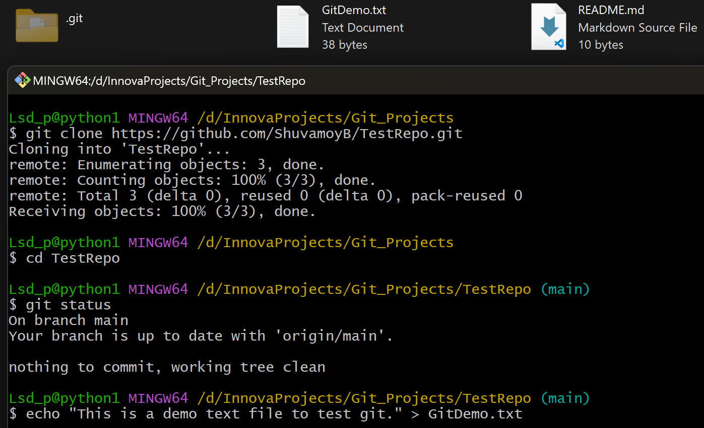

# Git_Tutorial
### Learning Git and GitHub

#### Documented by Shuvamoy Bhattacharya
 

### Git Lesson-1 Document uploaded in PDF, contains the explanation of basic git commends: 
+  `git clone`  
+  `git add .`  
+  `git commit -m`  
+  `git push`  

+  `git init`  
+  `git add .`  
+  `git commit -m`  
+  `git remote`  
+  `git remote add origin`  
+  `git push –u origin master`  

 

### 1. Create Repo in GitHub and Copy HTTPS Link
  
 

### 2. Open Git Bash and Clone the Repo
  
 
